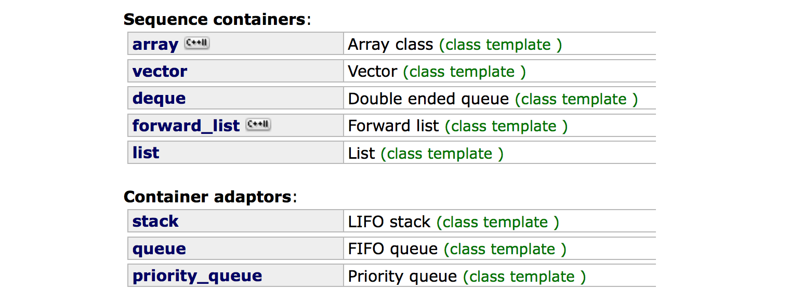

# Chapitre 4 - Structures linéaires

Ce chapitre présente les différentes structures de données séquentielles, c'est-à-dire pour lesquelles il y a un sens clair à parler de l'élément suivant et de l'élément précédent un élément. 

Bien qu'elles soient essentiellement présentées en python pour plus de clarté, à la fin de ce chapitre vous devriez maitriser en profondeur le fonctionnement des *sequence containers* et *container adaptors* de la [STL](http://www.cplusplus.com/reference/stl/) en C++. 

## Sequence container

Nous commençons par présenter les **tableaux**, dans lesquels les éléments sont stockés dans des emplacements consécutifs en mémoire. Nous augmentons progressivement la complexité des structures en présentant 

* tableau de taille fixe ([std::array](http://www.cplusplus.com/reference/array/array/) en C++)

* tableau de taille variable mais de capacité fixe

* buffer circulaire de début et taille variable mais capacité fixe

* tableau de taille et capacité variable ([std::vector](http://www.cplusplus.com/reference/vector/vector/) en C++)

Nous passons ensuite aux **listes chainées**, dans lesquelles les éléments sont stockés dans des emplacements individuels, mais qui maintiennent dynamiquement des liens vers l'élément suivant, et parfois vers le précédent. 

* la présentation de la liste simplement chainée ([std::forward_list](http://www.cplusplus.com/reference/forward_list/forward_list/) en C++) nous permet d'introduire petit à petit la notion d'itérateur, qui permet de se déplacer sur la structure sans en connaitre les détails de mise en oeuvre

* pour la liste doublement chainée ([std::list](http://www.cplusplus.com/reference/list/list/) en C++), nous inversons les choses en introduisant dès le début un itérateur et en voyant comme cela simplifie non seulement l'utilisation mais aussi la mise en oeuvre de la structure

* enfin, nous revenons sur les tris vu au chapitre 3 et discutons de la possibilité de les mettre en oeuvre sur des listes, et de la conséquence de ces structures sur leurs performances

Nous finissons la description des *sequence containers* par celle de la **double-ended queue** ([std::deque](http://www.cplusplus.com/reference/deque/deque/) en C++), qui utilise un buffer circulaire de pointeurs vers des tableaux de capacité fixe. 

##  Container adaptors

Nous étudions ensuite trois types de données abstraits (TDA) qui spécifient plus précisément les positions d'insertion et de suppression autorisées dans le conteneur. Ces TDA peuvent être mis en oeuvre par divers conteneurs concrets vus précédemment.

* le TDA **pile** ou **First in, last out (FILO)** ([std::stack](http://www.cplusplus.com/reference/stack/stack/) en C++) qui insère et supprime du même côté. Nous en voyons une application avec l'algorithme de Dijkstra à deux piles pour évaluer les expressions arithmétiques. 

* le TDA **queue** ou **First in, first out (FIFO)** ([std::queue](http://www.cplusplus.com/reference/queue/queue/) en C++) qui insère et supprime aux cotés opposés. 

* Le TDA **queue de priorité** ([std::priority_queue](http://www.cplusplus.com/reference/queue/priority_queue/) en C++) qui supprime les éléments par ordre de priorité décroissante. Ce TDA requiert que nous introduisions la **notion de tas** (heap in anglais) qui trie partiellement le contenu d'un tableau de sorte que son maximum soit en permanence à la position de tête. Il nous permet également de présenter un nouvel algorithme de tri: le tri pas tas. 